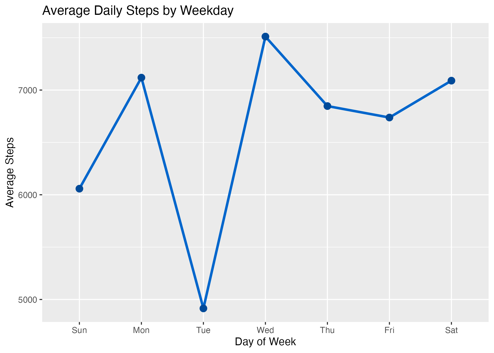

# Bellabeat Case Study — Data Analysis Report

**Author:** Reza Mahin Mohammadalizadeh  
**Tools:** R, tidyverse, ggplot2, dplyr, lubridate, knitr, R Markdown  
**Date:** December 2025  

---

## Overview
This project explores Fitbit smart device data to identify usage patterns and lifestyle trends among users.  
The analysis focuses on **daily activity, sleep, and calorie-burning behavior to generate actionable business insights for **Bellabeat**, a health-focused smart device company for women.

This case study was developed as part of the **Google Data Analytics Capstone Project** and demonstrates the full data analytics process — from cleaning and validation to visualization and business recommendations.

---

## Project Structure

| Folder | Description |
|---------|--------------|
| `Data/` | Raw and processed datasets (`daily_merged.csv`, `hourly_merged.csv`) |
| `Scripts/` | R scripts and R Markdown files for cleaning, transformation, and analysis |
| `Visuals/` | Exported plots used in the final report |
| `Docs/` | Final reports (HTML, PDF, and Markdown summary) |

---

## Analytical Process

1. **Data Cleaning & Preparation**
   - Imported, merged, and validated Fitbit CSV datasets.
   - Generated processed data frames: `daily_merged` and `hourly_merged`.

2. **Exploratory Data Analysis (EDA)**
   - Examined daily and hourly activity patterns.
   - Analyzed correlations among steps, intensity, and calories.
   - Explored sleep trends and sedentary behavior.

3. **Visualization**
   - Created descriptive plots using `ggplot2` to display key patterns:
     - Average steps by weekday  
     - Hourly activity intensity  
     - Steps vs. calories burned  
     - Sleep vs. activity duration  

4. **Insights and Recommendations**
   - Derived behavioral patterns and data-driven suggestions for Bellabeat’s marketing and product strategy.

---

## Key Findings

- Users show **peak activity between 17:00–20:00**.  
- **Steps and calories burned** are strongly correlated.  
- Most users sleep **6–7 hours per night**.  
- **Tuesday** is typically the least active day.  
- More active users tend to have **fewer sedentary minutes**.

---

## Business Recommendations

- Encourage regular movement through **in-app notifications** and **short activity challenges**.  
- Offer **personalized sleep recovery tips** based on fatigue detection.  
- Introduce **weekday-specific challenges** to maintain engagement.  
- Integrate **heart-rate analytics** for personalized calorie tracking.  
- Market Bellabeat devices as **wellness companions** promoting activity, rest, and recovery.

---

## Deliverables

- 📄 [Bellabeat_Case_Study_Report.pdf](Docs/Bellabeat_Case_Study_Report.pdf)  
- 🌐 [Bellabeat_Case_Study_Report.html](Docs/Bellabeat_Case_Study_Report.html)  
- 📊 Processed data: [`daily_merged.csv`](Data/Processed/daily_merged.csv) and [`hourly_merged.csv`](Data/Processed/hourly_merged.csv)

---

## Next Steps
Future work could include:
- Building an interactive **Tableau dashboard** for visual exploration.  
- Applying **predictive modeling** to forecast user activity or calorie burn.  

---

## Contact
If you have questions or feedback, feel free to reach out:  
📧 reza.alizadeh.data@gmail.com  
🔗 [LinkedIn Profile](https://www.linkedin.com/in/rezaalizadeh)

---

© 2025 Reza Mahin Mohammadalizadeh — This project is for educational and professional portfolio purposes.
